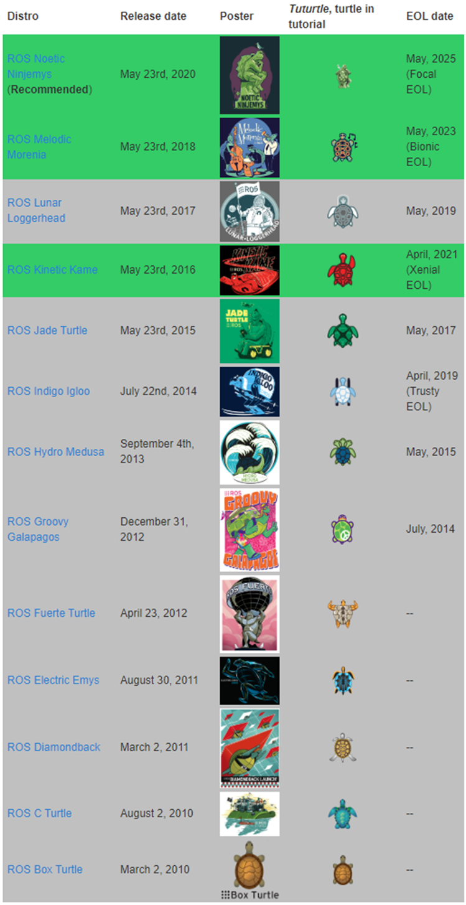

# 1.1.1 从ROS到ROS2：为什么要"推倒重建"？

1、什么是Ros？

ROS（Robot Operating System）是一套可部署于Linux、Windows、macOS等操作系统之上的软件库与工具集，旨在为机器人系统的开发提供模块化、可复用的基础设施。

2、ros的发展历程

**ROS1** 时代（2007-2020）：由斯坦福大学人工智能实验室（SAIL）发起，后由 Open Robotics 维护，凭借模块化、开源化的优势，成为全球机器人研究的事实标准，广泛应用于服务机器人、无人机、机械臂等领域。但核心局限明显：不支持实时性、无法实现多机器人高效协同、通信机制无安全加密、仅适配 Linux 系统。

**ROS2** 时代（2017 - 至今）：基于DDS 数据分发服务完全重构，2022 年发布的Humble Hawksbill是 LTS 长期支持版本（支持至 2027 年），也是工业界、学术界最推荐的稳定版本。ROS2 从实验室研究工具，升级为工业级机器人开发平台。 
