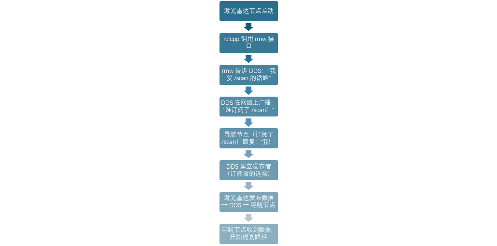

# 1.4.2 一次通信的完整流程

光说架构可能还有点抽象，我们走一遍真实的数据流，你就全明白了。

假设你有一个激光雷达节点发布 /scan 话题，一个导航节点订阅它。整个过程是这样的：

这个过程看起来复杂，但DDS全自动完成，你只需要写一个发布者（publisher），一个接收者（subscriber）剩下的DDS帮你搞定，是不是很方便呢。

通过实际的例子，相信你对ROS的架构有了一定的了解，那接下来我们细聊一下“ROS2的通信底座”DDS吧。
