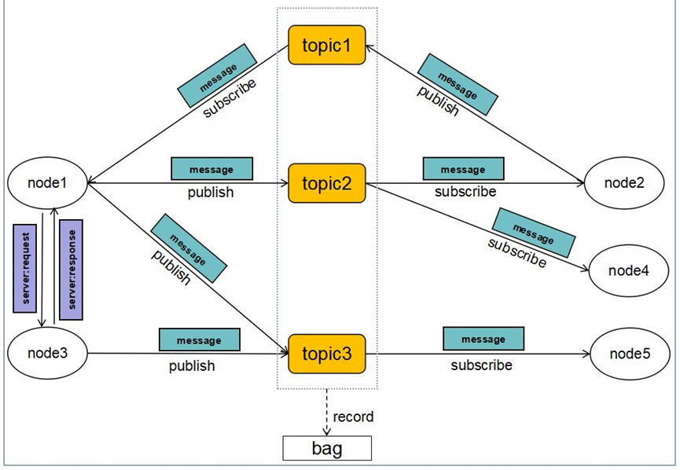

# 2.1.1 节点的定义

节点是 ROS 2 中最基本的计算单元，是执行具体任务的进程。每个节点负责系统中一个特定的功能模块，例如：传感器数据采集、运动控制、路径规划、图像处理……

一个ROS2系统中可以运行任意数量的节点，节点之间通过ROS2通信机制进行数据交换，彼此解耦，互不干扰。这种设计显著提升了系统的模块化程度与容错能力。

那一个ROS2系统可以有多少节点🧐

理论上无数个——你可以根据功能需求自由拆分，想开多少开多少。

