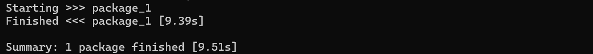

# 2.2.3 常用命令

1. 创建工作空间

```
mkdir -p TCEI_ws/src
```

2. 创建功能包

```
cd TCEI_ws/src
ros2 pkg create --build-type ament_cmake package_1
```

3. 编译工作空间

```
cd ..
colcon build
```

出现这个画面说明成功了



提醒：每次打开新终端，都要 `source` 工作空间（意思就是刷新环境变量），否则ROS2找不到你的包。
