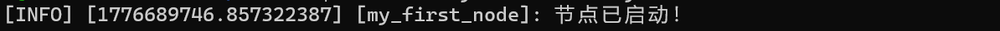

# 2.3.1 创建第一个节点

1、创建功能包

```
cd ~/TCEI_ws/src
ros2 pkg create --build-type ament_cmake my_first_node --dependencies rclcpp 
```

`--dependencies rclcpp` 依赖ROS2客户端库和标准消息，当然你后续也可以在CMakeList文件中配置

`--dependencies` 就像告诉ROS2：“我这个包需要用到这些工具。

2、编写节点代码

在 `my_first_node/src/` 下创建 `my_first_node.cpp`：

```c++
//头文件，包含你所需的依赖及功能函数
#include "rclcpp/rclcpp.hpp"
//定义一个节点类
class MyFirstNode : public rclcpp::Node
{
public:
    MyFirstNode() : Node("my_first_node")
{
	//打印输出
        RCLCPP_INFO(this->get_logger(), "节点已启动！");
    }

};
//初始化节点，开始工作
int main(int argc, char **argv)
{
    rclcpp::init(argc, argv);
    auto node = std::make_shared<MyFirstNode>();
    rclcpp::spin(node);
    rclcpp::shutdown();
    return 0;
}

```

3、修改CMakeLists.txt

在 `my_first_node/CMakeLists.txt` 末尾添加：

```
add_executable(my_first_node src/my_first_node.cpp)
ament_target_dependencies(my_first_node 
rclcpp 
std_msgs
)

install(TARGETS my_first_node
    DESTINATION lib/${PROJECT_NAME})

```

这段的意思是：告诉编译器“这个cpp文件要编译成一个可执行文件，并且需要链接ROS2的库”。

4、 编译与运行

```
cd ~/TCEI_ws
// 格式：colcon build --packages-select <package_name>
colcon build --packages-select my_first_node
source install/setup.bash
//运行节点
// 格式：ros2 run <packages_name> <executable_name>
ros2 run my_first_node my_first_node
```

看到这个输出，就成功了：



恭喜！你写了第一个ROS2节点！


