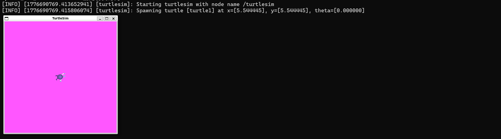

# 2.4.2 声明和获取参数

那我们该如何使用参数呢，先了解一下参数的类型：

参数可以是整数(int)、浮点数(float)、布尔值（bool）、字符串(string)，甚至数组，这些基本够用了，那我们跟着流程走，就可以获取一个可灵活修改的参数了。

1.创建变量（param\_name）给一个初始值，一般都是在私有权限下创建

2.声明参数，在构造函数中进行

```c++
this->declare_parameter<参数类型>(" param _name", param_name);
```

3.调用参数

```c++
this->get_parameter("param _name ", param _name);
```

4.然后运行节点，在终端中修改节点

```
ros2 run turtlesim turtlesim_node --ros-args -p < param_name >:=<value>
```

5.实例

```
ros2 run turtlesim turtlesim_node --ros-args \
-p background_r:=255	# 设置背景色红色通道为100\
-p use_sim_time:=true 	# 启用仿真时间 
```


